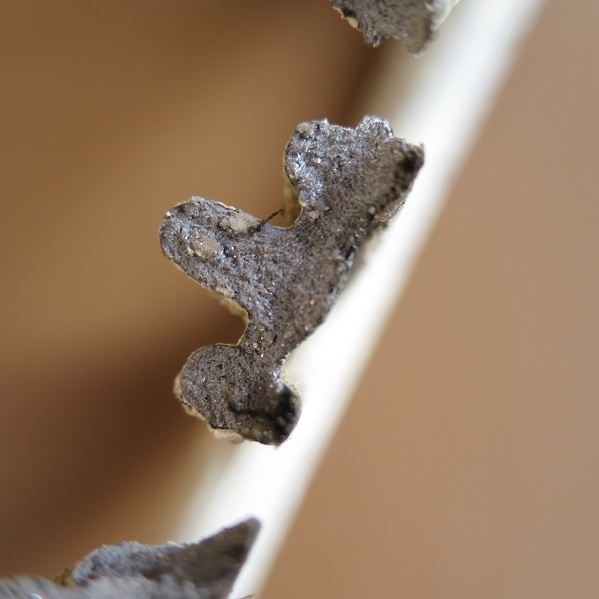

# Fracture Mechanics
This repository includes solutions to fundamental problems in fracture mechanic. Elasticity is utilized in developing the solution.

The problems are
- [Kirsch solution](https://www.youtube.com/watch?v=teIEWKqxQDU) to an infinite plate with a circular hole (1898)

Brittle fracture of a cast-iron pulley.